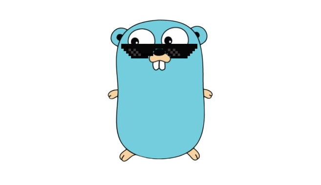

# Go Client for Iyzico API




[](https://goreportcard.com/report/github.com/JspBack/iyzipay-go)
[](https://pkg.go.dev/github.com/JspBack/iyzipay-go)


`iyzipay` paketi, Iyzico API ile etkileşim kurmak için bir Go istemcisi sağlar. Bu paket, Non3DS istekleri, BIN kontrolü ve ödeme sorgulamaları gibi çeşitli işlevleri destekler.

## Kurulum

Paketi yüklemek için `go get` komutunu kullanın:

```bash
go get github.com/JspBack/iyzipay-go
```

## Özellikler

- Non3DS İstekleri: Non3DS ödeme isteklerini işleyin.
- BIN ve taksit Kontrolü: Kredi kartı BIN'lerini ve taksitlerini doğrulayın.
- Ödeme Sorgulama: Ödeme durumlarını sorgulayın.
- 3DS İstekleri: 3D Secure işlemleri desteği.
- PWI Desteği: Ödeme Penceresi Entegrasyonu (ödemek için yeni bir ekran açar).
- Ödeme Formu Entegrasyonu: Sorunsuz ödeme işleme için ödeme formlarını entegre edin.
- MarketPlace API'leri: MarketPlace API'leri ile etkileşim. (yada MerchantPlace)
- Kart Saklama: Kullanıcıların kredi kartı bilgilerini güvenli bir şekilde saklayın ve tekrar eden ödemeler için kullanın.
- Abonelik API'leri: Abonelik hizmetlerini yönetin.

## Planlanan Özellikler

- Iyzilink API'leri: Iyzilink hizmetleri ile entegrasyon.
- EFT API'leri: Elektronik Fon Transferi desteği.
- Ekstra Hizmetler: Diğer ekstra hizmetler eklenecektir.

## Örnekler

Örnekler /examples dosyası içerisinde.

## Notlar

Şu an hala geliştirme aşamasında muhtemelen hatalara denk gelebilirsiniz.(Ayrıca ilk go paketim 😄)

## Katkıda Bulunma

Bir pull request oluşturarak projeye destek olabilirsiniz. 🙂

## Bilinen Problemler

- Unauthorized (401) hataları panic oluşturuyor (hata formatı farklı olduğu için).
- Pazaryeri, Abonelik, İptal ve iade örnekleri yok (test edilmediler).

## Lisans

MIT Lisansı altında dağıtılmaktadır, daha fazla ayrıntı için lütfen kod içindeki lisans dosyasına bakın.

[Read this in english](en.README.md)
